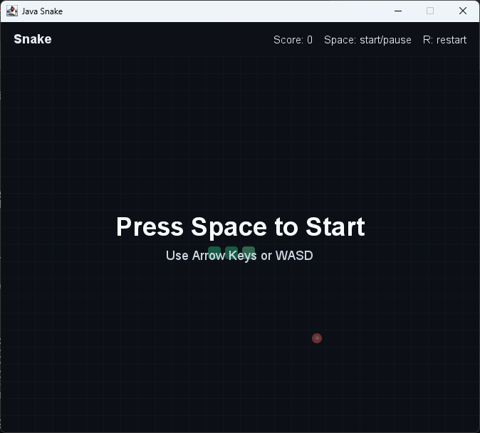

# Java Snake Game

一个使用 Java Swing 编写的贪吃蛇小游戏，无需第三方依赖。

## 运行方式

在 Windows PowerShell 或命令提示符中进入项目目录后运行：

```powershell
.\run.bat
```

也可以手动编译运行：

```powershell
javac -encoding UTF-8 -d out src\main\java\com\example\snake\*.java
java -cp out com.example.snake.SnakeGame
```

## 操作

- 方向键或 WASD：控制移动方向
- 空格：开始 / 暂停 / 继续
- R：重新开始

## 界面


